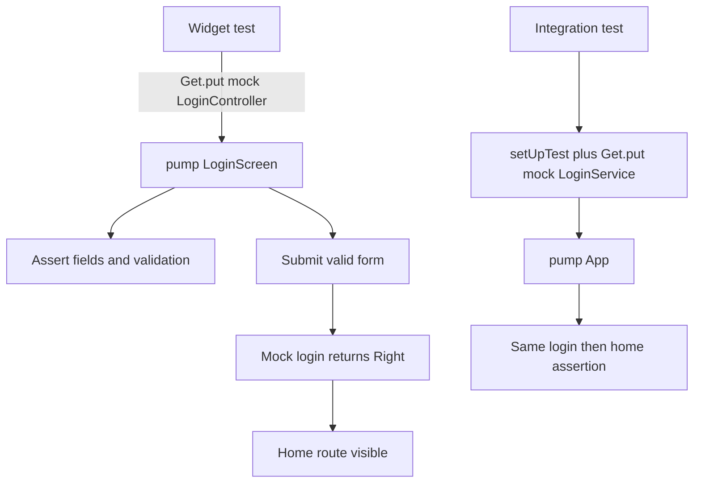

# Login widget and integration tests

Add example widget and integration tests for the existing login feature so new features can copy them. Unit tests already exist. The integration test boots the real `App` (`GetMaterialApp` + routes) but does not call a backend: `main_dev` sets `apiUrl` to `''`, so `LoginService` is replaced with a mocktail mock that returns success.

## Scope (confirmed)

- **Integration login result:** Offline. Start the real app, override `LoginService` with a mock that returns `Right(LoginResponse(...))`.
- **Existing unit tests:** Keep `test/features/login/controllers/login_controller_test.dart` and `test/features/login/services/login_service_test.dart` as they are. The service file stays an incomplete GetConnect example (README / file comment already say service tests are skipped for new features).
- **Mocking library:** `mocktail` (already in `pubspec.yaml`). Do not add `mockito` / `build_runner`.
- **Skill patterns:** `flutter-testing-skill` — widget tests use `testWidgets` under `test/`; integration tests use `IntegrationTestWidgetsFlutterBinding` under `integration_test/`.

## Assumptions

- Visible strings in tests are translation keys (`phone_number`, `password`, `login`, `home`) unless `AppTranslation` is loaded. Prefer finding `AppInput` / button text by those keys so tests do not depend on locale copy.
- Phone used in the happy path must pass `Validate.phone` in `lib/core/utils/validate.dart` (reuse a valid sample already used in the service test, e.g. `09882202201`, and a password that passes `Validate.pass`).
- `Get.put<LoginService>(mock)` before `pumpWidget(const App())` wins over `loginRoute`'s `Get.lazyPut<LoginService>(() => LoginServiceImpl())`, because lazyPut does not replace an instance that is already registered. If that does not hold when implemented, override only the login `GetPage` binding in the test's `GetMaterialApp` instead of changing production `login_route.dart`.

## Flow

## Current codebase notes

- README Testing (`README.md` around the Testing section) already requires unit + widget + integration tests and points at `test/features/login`. That folder only has:
  - [`test/features/login/controllers/login_controller_test.dart`](test/features/login/controllers/login_controller_test.dart)
  - [`test/features/login/services/login_service_test.dart`](test/features/login/services/login_service_test.dart)
- Shared setup: [`test/shared/base_test.dart`](test/shared/base_test.dart) (`AppConfig`, `GlobalBinding`, `Get.testMode`).
- Login UI: [`lib/features/login/screens/login_screen.dart`](lib/features/login/screens/login_screen.dart) (`GetView<LoginController>`), form in [`lib/features/login/screens/widgets/login_form.dart`](lib/features/login/screens/widgets/login_form.dart). Inputs use `AppInput` + `'phone_number'.tr` / `'password'.tr`; submit calls `controller.login` only after `saveAndValidate()`.
- Success path in [`lib/features/login/controllers/login_controller.dart`](lib/features/login/controllers/login_controller.dart): saves token, sets `isLoginSucces`, `Get.offNamed(Routes.home)`.
- DI: [`lib/features/login/login_route.dart`](lib/features/login/login_route.dart) lazily creates `LoginServiceImpl` + `LoginController`. Home is [`lib/features/home/home_route.dart`](lib/features/home/home_route.dart) (`'home'.tr`).
- App entry for a full pump: [`lib/app.dart`](lib/app.dart) `App` (`initialRoute` defaults to login) and [`lib/main_dev.dart`](lib/main_dev.dart) (`apiUrl: ''`).
- `integration_test` is not in [`pubspec.yaml`](pubspec.yaml). No `integration_test/` folder yet.

## 1. Widget test for LoginScreen

Cover render, invalid submit, and successful navigation with a mocked service. `LoginScreen` reads `GetView` controller, so register the controller (and dependencies) before `pumpWidget`.

Files:

- `test/features/login/screens/login_screen_test.dart` (new)
  - Reuse `setUpTest()` and the same `MockLoginService` / `MockStorage` pattern as the controller test.
  - `Get.put` a real `LoginController` built with those mocks.
  - Pump `GetMaterialApp` with `home: const LoginScreen()`, `translations: AppTranslation()`, and both login + home `getPages` so `Get.offNamed(Routes.home)` can resolve. Also wrap with `ResponsiveBreakpoints.builder` using the same MOBILE/TABLET/DESKTOP breakpoints as `app.dart` if `LoginScreen` (or a child) reads them.
  - Cases:
    1. Shows phone field, password field, and login button (`find.text('phone_number')`, `find.text('password')`, `find.text('login')` — keys if untranslated, or translated strings if `AppTranslation` is loaded; assert whichever the pump actually renders).
    2. Tap login with empty phone → validation text `phone_number_required` (or its translation), and `login` on the mock is not called.
    3. Enter a valid phone and password, stub `login` to `Right(LoginResponse(userID: 123, token: 'token'))`, tap login, `pumpAndSettle`, expect home (`find.text('home')` or translated home title) and `verify` the mock was called once.
  - `tearDown`: `Get.reset()`.

## 2. Integration test for login → home

Boots the same `App` widget the dev entry uses, with the login API mocked.

Files:

- [`pubspec.yaml`](pubspec.yaml) — add `integration_test: sdk: flutter` under `dev_dependencies`.
- `integration_test/login_flow_test.dart` (new)
  - `IntegrationTestWidgetsFlutterBinding.ensureInitialized()`.
  - `setUp`: `configDev()` (or `AppConfig.set` like `setUpTest`), `GetStorage.init()`, `GlobalBinding().dependencies()`, `Get.testMode = true`.
  - `Get.put<LoginService>(mock)` that returns the same success `LoginResponse` as the unit test. Do not hit HTTP.
  - `tester.pumpWidget(const App())`, then `pumpAndSettle`.
  - Enter valid phone/password, tap login, `pumpAndSettle`, expect the home title.
  - `tearDown`: `Get.reset()`.

## 3. README pointer

The Testing section already tells people to copy `test/features/login`. Integration tests cannot live only in that folder (`integration_test/` must sit at the package root).

Files:

- [`README.md`](README.md) Testing section — keep the current wording, and add the two example paths: widget test `test/features/login/screens/login_screen_test.dart`, integration test `integration_test/login_flow_test.dart`.

## Out of scope

- Golden / visual regression tests.
- TestMu AI / real-device cloud runs.
- Completing or deleting the GetConnect service test.
- Changing production login DI or adding widget `Key`s (find by translation key / type is enough for this example).
- Adding a real API base URL or test account.

## Test plan

1. `flutter test test/features/login/controllers/login_controller_test.dart` still passes.
2. `flutter test test/features/login/screens/login_screen_test.dart` passes: empty phone shows required error and does not call login; valid form navigates to home.
3. `flutter test integration_test/login_flow_test.dart` passes on the host (debug device or `flutter test` integration target) without network: login then home title is visible.
4. README Testing section lists both new paths.
