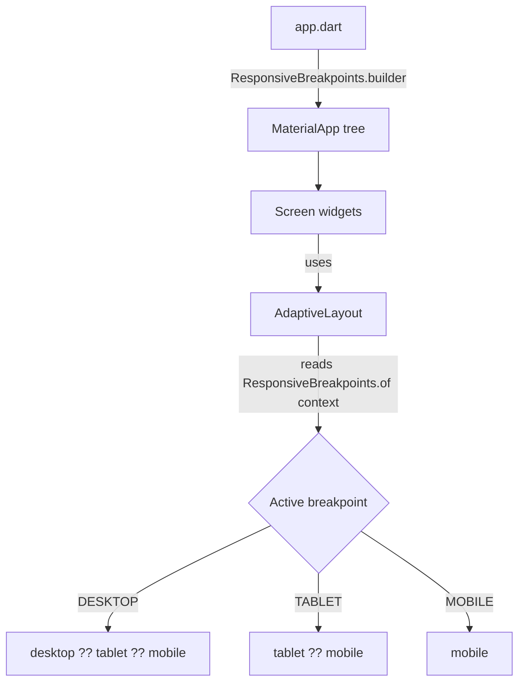

# Responsive framework migration

## Scope (confirmed)

- **Scaling replacement:** Convert `.sp` / `.w` / `.h` / `.r` to plain `double` values. `responsive_framework` handles scaling/resizing at the app level via breakpoints (AutoScale), so per-value scaling extensions are dropped.
- **AdaptiveLayout breakpoint source:** Read `responsive_framework`'s `ResponsiveBreakpoints` from `context` (single source of truth, configured once in `app.dart`).
- **Fallback behavior:** `desktop → tablet → mobile` cascade. `tablet` null → use `mobile`; `desktop` null → use `tablet` (then `mobile`).
- **Package version:** `responsive_framework: ^1.5.1`.

## Assumptions

- Breakpoint thresholds: `MOBILE` 0–599, `TABLET` 600–1023, `DESKTOP` 1024+. Adjustable later in `app.dart`.
- Existing numeric values (e.g. `10.sp`, `8.h`) keep the same base number, just without the scaling suffix (e.g. `10`, `8`). Visual result on mobile stays close to today's baseline.

## Flow

## Current codebase notes

- Dependency declared in [`pubspec.yaml`](pubspec.yaml) as `flutter_screenutil: ^5.9.3`.
- `flutter_screenutil` is imported / used in:
  - [`lib/app.dart`](lib/app.dart) — `ScreenUtilInit` wraps `ShadApp.custom` (lines 14, 56).
  - [`lib/core/constants/diemsions/dimensions.dart`](lib/core/constants/diemsions/dimensions.dart) — import for the `part` files below.
  - [`lib/core/constants/diemsions/sizes.dart`](lib/core/constants/diemsions/sizes.dart) — `.h` / `.w` / `.r` for `h*`, `w*`, `s*` constants.
  - [`lib/core/constants/diemsions/font_sizes.dart`](lib/core/constants/diemsions/font_sizes.dart) — `.sp` for `fz*` constants.
  - [`lib/shared/widgets/input/app_input.dart`](lib/shared/widgets/input/app_input.dart) — `.h` / `.w` / `.r` (lines 5, 41, 60, 64, 65, 72, 74).
- `sized_boxes.dart` derives from the `h*` / `w*` constants via `num_extensions.dart` (`.hsb` / `.wsb`) — no direct screenutil usage, so it needs no change once the constants become plain doubles.
- No existing `AdaptiveLayout` or responsive widget under `lib/shared/widgets/` — new file needed.
- Shared widgets live flat/grouped under `lib/shared/widgets/` (e.g. `input/`, `button/`, `common/`).

## 1. Swap dependency

Replace the screenutil dependency with responsive_framework.

Files:

- [`pubspec.yaml`](pubspec.yaml) — remove `flutter_screenutil: ^5.9.3`, add `responsive_framework: ^1.5.1`. Run `flutter pub get`.

## 2. Strip scaling extensions from constants

Turn scaled values into plain doubles; remove the screenutil import.

Files:

- [`lib/core/constants/diemsions/dimensions.dart`](lib/core/constants/diemsions/dimensions.dart) — remove `import 'package:flutter_screenutil/flutter_screenutil.dart';`.
- [`lib/core/constants/diemsions/font_sizes.dart`](lib/core/constants/diemsions/font_sizes.dart) — `10.sp` → `10`, etc. (keep `late final double`).
- [`lib/core/constants/diemsions/sizes.dart`](lib/core/constants/diemsions/sizes.dart) — `1.h` / `1.w` / `1.r` → plain numbers. Note: pre-existing quirk `w40 = 40.h` becomes `40` (bug becomes harmless once suffixes are gone).
- [`lib/shared/widgets/input/app_input.dart`](lib/shared/widgets/input/app_input.dart) — remove screenutil import; `8.h` → `8`, `10.h`/`16.w` → `10`/`16`, `1.r`/`1.5.r`/`8.r` → `1`/`1.5`/`8`.

## 3. Wire responsive app root

Replace `ScreenUtilInit` with `responsive_framework`'s breakpoint builder.

Files:

- [`lib/app.dart`](lib/app.dart):
  - Swap import `flutter_screenutil` → `responsive_framework`.
  - Remove the `ScreenUtilInit(builder: ...)` wrapper.
  - Wire `ResponsiveBreakpoints.builder` into `GetMaterialApp.builder` (returning it around `ShadAppBuilder`), so breakpoints are available in the widget tree below `MaterialApp`. Define breakpoints:
    - `Breakpoint(start: 0, end: 599, name: MOBILE)`
    - `Breakpoint(start: 600, end: 1023, name: TABLET)`
    - `Breakpoint(start: 1024, end: double.infinity, name: DESKTOP)`

## 4. Create AdaptiveLayout shared widget

New reusable widget selecting a builder by active breakpoint with cascade fallback.

Files:

- `lib/shared/widgets/adaptive_layout.dart` (new):
  - Signature: `AdaptiveLayout({required WidgetBuilder mobile, WidgetBuilder? tablet, WidgetBuilder? desktop})`.
  - In `build`, read `ResponsiveBreakpoints.of(context)`:
    - `isDesktop` → `desktop ?? tablet ?? mobile`
    - `isTablet` → `tablet ?? mobile`
    - else → `mobile`
  - Keep it a `StatelessWidget`, no logic beyond selection (per project rule: no logic in widgets).

## 5. README responsive note

Document the approach so future features follow it.

Files:

- [`README.md`](README.md) — add a `### Responsive` subsection under the `## Source Base Guide & Conventions` UI area, covering:
  - `responsive_framework` replaces `flutter_screenutil`; use plain double sizes (no `.sp/.w/.h/.r`).
  - Breakpoints (MOBILE/TABLET/DESKTOP) are configured in `app.dart`.
  - Use `AdaptiveLayout(mobile:, tablet:, desktop:)` for layout branching; tablet/desktop optional with cascade fallback.

## Out of scope

- Building actual tablet/desktop layouts for existing screens (home/login) — only the mechanism is added.
- Tuning breakpoint thresholds beyond the defaults above.
- Replacing `sized_boxes.dart` / `num_extensions.dart` structure (they keep working as-is).

## Test plan

1. `flutter pub get` succeeds; no remaining `flutter_screenutil` import (`grep` clean).
2. App builds and runs on a phone-sized window (MOBILE) — UI matches today's baseline.
3. Resize to tablet/desktop widths — `AdaptiveLayout` returns provided builder; when tablet/desktop null, falls back per cascade.
4. `AdaptiveLayout` with only `mobile` provided renders mobile at all widths.
5. Existing widgets using dimension constants (`app_input`) render without overflow/regressions.
6. Existing unit tests (`test/features/login`) still pass.
